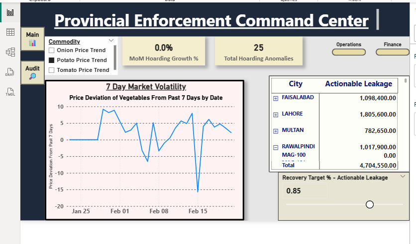
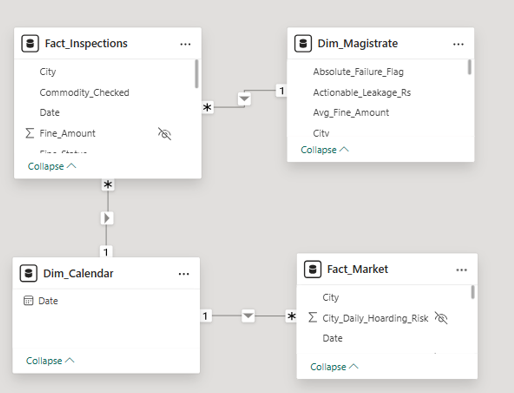
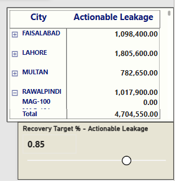
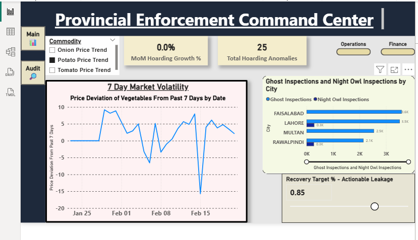
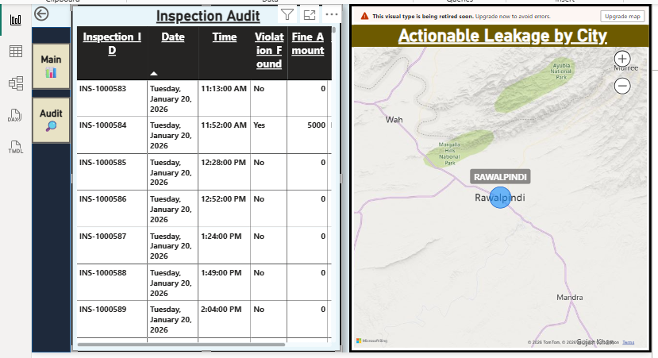

<br><br>

# Provincial Enforcement Command Center
### A Data Pipeline, Statistical Audit & Power BI Dashboard for Government Market Enforcement

---

> *A Data Analytics Project built to expose fraud, detect hoarding, and recover millions in lost government revenue — using Python, SQL, and Power BI.*

---

## Project Overview

This Data Analytics project combines real market data with simulated enforcement data to demonstrate a fraud detection framework.

Every day, field magistrates across Punjab are supposed to walk into markets, inspect prices, and make sure traders aren't exploiting consumers.

On paper, the system works. In reality? 

Some magistrates were logging 1,085 inspections in a single month — with an average of *2 minutes per inspection*.

Markets are physically closed when half those entries were timestamped. And the government? Issuing fines nobody ever actually paid.

This project audits and evaluates the system using a data-driven approach.

I built a data analytics solution that includes
- scraping agricultural market data off a government portal (http://www.amis.pk),
- cleaning and improving corrupted supply datasets,
- engineering a SQLite data warehouse,
- running statistical fraud detection in Python,
- packaging every finding into a Power BI dashboard 

The result: **Using simulated data, Rs. 4.7 Million in actionable revenue leakage** was identified, **four high-risk magistrate profiles were identified**, and **25 hoarding events** identified across Punjab's four cities.


---

## Objectives

- Understand how real-world systems fail silently
- Detect fraud hidden inside normal-looking data
- Resurrect corrupted supply datasets using Python 
- Separate real problems (shortages) from man-made ones (hoarding)
- Build a clean, reliable data warehouse using SQLite
- Statistically profile 145 field magistrates for fraud
- Quantify the exact financial damage
- Deliver everything into a Power BI dashboard that empowers non-technical executives to investigate and act

At its core, this project is about one thing:
> *Turning raw data into decisions that actually matter.*

---

## Table of Contents

1. [The Business Problem: Why This Matters](#the-business-problem-why-this-matters)
2. [Tech Stack](#tech-stack)
3. [Data Preparation & Feature Engineering](#data-preparation--feature-engineering)
4. [Statistical Methods Used](#statistical-methods-used)
5. [Key Business Insights](#key-business-insights)
6. [Dashboard Preview](#dashboard-preview)
7. [Project Capabilities](#project-capabilities)
8. [Real-World Impact](#real-world-impact)
9. [How to Run the Project](#how-to-run-the-project)
10. [Output Files Generated](#output-files-generated)
11. [Limitations](#limitations)
12. [Future Enhancements](#future-enhancements)
13. [Author](#author)

---

## The Business Problem: Why This Matters

Pakistan's provincial governments have a price control enforcement system. On paper, it looks good: magistrates conduct daily inspections, issue fines, and submit logs. 
But there’s a dangerous illusion:

Everything looks under control… but it isn’t.

Here’s what’s actually happening:

- Prices go up → Nobody knows why
- Field officers report high activity → But much of it is fake
- Fines are issued → But money is never recovered
- Reports look clean → Reality is messy and broken

This creates three major failures:

1. Blind decision making - 
No way to distinguish shortage vs manipulation

2. KPI gaming - People optimize metrics, not outcomes

3. Revenue leakage - Millions lost, but buried in reports

This project builds the analytical dashboard to see the crises clearly, quantify them in Rupees, and give decision-makers the tools to respond, without relying on the magistrates who are manipulating the system.


---

## Tech Stack

| Task| Tools Used |
|---|---|
| **Web Scraping** | Python, Selenium, undetected-chromedriver |
| **Data Wrangling** | Python, Pandas, NumPy |
| **Data Warehousing** | SQLite3 |
| **Statistical Analysis** | SciPy (t-test), Pearson Correlation, Z-score normalization |
| **Anomaly Detection** | Custom moving-average logic (Pandas rolling window) |
| **Dashboard & Visualization** | Microsoft Power BI, DAX, Power Query |
| **Data Storage** | CSV, SQLite (.db) |


---

## Data Preparation & Feature Engineering

This was the most challenging part of the project.

**Real-world data is messy and this project proved it.**

### Step 1 — Scraping a Legacy Government Portal 

- The Punjab AMIS prices portal (http://www.amis.pk) is a  ASP.NET website that needs to be clicked through manually, city by city, date by date.
- No API → scraped data using Selenium

The output: **1417 rows** of daily price data across 4 cities and 6 commodities, covering January 2026 to February 2026.

### Step 2 — Resurrecting a Corrupted Dataset

- The supply/arrivals data came back from the AMIS website completely broken
- The server had dumped the entire dataset into a single CSV cell as an unstructured text. 
- I reverse-engineered the structure. The raw text had a consistent pattern of 19 data points per logical row. 
- I wrote a custom parsing function that sliced the unstructured into chunks, validated each chunk's serial number, and mapped the output to my target cities and commodities.

This process recovered 104 rows of supply data

### Step 3 - Building the Master Market Fact Table

I merged the two datasets on Date × City keys after normalizing commodity names (e.g. "Potato Fresh" → "Potato"), pivoting from long to wide format, and verifying unit parity (prices in Rs./100Kg, supply in Quintals).

Output: **93 clean rows** powering all downstream anomaly detection.

### Step 4 - Simulating Field Inspection Data

- No real-time government inspection logs were available 
- Simulated a dataset of **46,892 inspection records** across **145 magistrates**
- Deliberately added specific magistrates with known fraud patterns (speedrunning, night logging, mega-fines with 0% recovery)

### Step 5 - Temporal Feature Engineering in SQL

- Computed `Minutes_Since_Last_Inspection` for every single record using SQL window function ( LAG() ), the time gap between one officer's inspection and their previous one. 
- For fraud detection downstream

### Step 6 - Building the SQLite Data Warehouse & Star Schema
- I built a local SQLite data warehouse (PCCMD_Warehouse_New2.db) to perform the statistical audit.
- I structured the warehouse using a Star Schema architecture
- Exported the generated CSVs to power the BI dashboard

1. Fact_Inspections — the central fact table holding every individual inspection log
2. Fact_Market — the macroeconomic market data fact table
3. Dim_Magistrate — a dimension table profiling all 145 officers across Lahore, Faisalabad, Rawalpindi, and Multan


<br><br>


---

## Statistical Methods Used

I applied real statistical methods to answer real questions.

### 1. Fraud Detection (Arithmetic Mean (μ), Standard Deviation (σ), Proportion (∝):)

Rather than scanning 46,892 rows manually, I used `numpy.where()` to flag violations at row level, then compressed everything into 145 magistrate profiles using `groupby()`. Two rules:

- **Night Owls** — any inspection logged between 22:00 and 05:00
- **Speedrunners** — any inspection logged less than 8 minutes after the previous one


### 2. Hoarding Detection (7-Day Moving Average Anomaly Engine)

A price spike only becomes suspicious when supply isn't falling. I calculated rolling 7-day average prices using `pandas.rolling(window=7).mean()`, then flagged records where:
1. Price was >10% above the moving average
2. Day-over-day supply was flat or increasing `pct_change()`
3. Supply volume was above zero (not a market closure day)

**Why a moving average instead of raw prices?** Raw daily prices have too much noise. A moving average smooths out normal bazaar volatility and makes real anomalies stand out clearly.

**Result:** 25 hoarding events across 20 trading days. Faisalabad had the most (9 flags). Onions surged 69.7% above trend — with stable supply.

### 3. Revenue Audit (Z-Score)

- Compared expected vs actual collections
- Applied SLA threshold (85%) and calculated "Actionable Leakage" as the gap between expectation and reality.
- Used Z-scores to detect abnormal behavior

**Result:** Rs. 4.7M in actionable leakage (simulated data). MAG-120 in Lahore: average fine of Rs. 11,021, recovery rate of 0%. 

### 4. Time-Series Concepts & Hypothesis Testing

- Tested whether fraud leads to price spikes
- I engineered price variables using `.shift()`- checking whether today's fraud predicts prices 1, 3, 5, and 7 days later.
- Pearson Correlation to measure predictive signal`s strength.
- Also used Welch's t-test (P-value) to compare future prices following "Gold Standard" days (0% fraud) vs. "Systemic Collapse" days (>15% fraud).

**Result**: Inconclusive. The 30-day data didn't produce enough systemic collapse days to run the test safely.

---

## Key Business Insights

**1. Rs. 4.7 Million in Recoverable Revenue Leakage**
- Concentrated in very few magistrates 
- Specifically MAG-120 in Lahore and MAG-220 in Rawalpindi
- Lahore alone: -Rs. 1.8M leakage with 14 absolute SLA failures.


<br><br>

**2. The Culprits**
- MAG-410 and MAG-310 logged 1,085 inspections each in a single month — triple the provincial average — with fraud rates above 41%. Their average time between inspections: 2 minutes. 
- MAG-105 logged 290 out of 333 total inspections after midnight.

**3. Faisalabad Is the Highest-Risk Market for Hoarding Activity**
- 9 of 25 hoarding flags came from Faisalabad.
- Onions and tomatoes were the most manipulated commodities. 

**4. Price spikes often occurred without supply drops → hoarding**

---

## Dashboard Preview


<br><br>


<br><br>


<br><br>


---
## Project Capabilities

- Star Schema Data Model 
> fact tables at the centre 
>> dimension tables around them,
>>> clean one-to-many relationships throughout
- Detect fraudulent behavior 
- Identify market manipulation
- One-click switching between departmental data views
- Dynamic slicer toggles between price trends
- Quantify financial losses accurately
- Secure data access via Row-Level Security (RLS)
- Instant insights via map hover
- Allow policy simulation (What-If slider)
- Drill-down to individual records - one click audit

**It’s designed to scale:**

The same logic can be applied to:

- Telecom operations
- Retail audits
- Supply chain monitoring
- Compliance tracking
---

##  Real-World Impact

This project reframes how governments or any large organization think about operational oversight.
If deployed in a real environment, this system would:

- Reduce uncollected fines
- Improve accountability
- Detect fraud early
- Enable data-driven policy decisions
- Replace reactive management with proactive control

---

## How to Run the Project

This project has two independent components: a Python analytics pipeline and a Power BI dashboard. They share data but run separately.

#### Step 1: Clone the Repository
```bash
git clone [https://github.com/hannanbaig347/provincial-enforcement-command-center-powerbit](https://github.com/hannanbaig347/provincial-enforcement-command-center-powerbi)
cd provincial-enforcement-command-center

```


#### Step 2: Install dependencies

```bash
pip install -r requirements.txt
```

#### Step 3: The Analytical Pipeline (Jupyter Notebooks)
The core logic, ETL, and statistical fraud detection were executed in Python. Navigate to the /Notebooks folder ***and run them in this exact sequence***:

- 01_Data_Scraping_AMIS_Portal.ipynb (Scrapes raw data from http://www.amis.pk)

- 02_ETL_and_Merge.ipynb (Cleans and merges supply/price datasets)

- 03_Synthetic_Telemetry_Generation.ipynb (Generates simulated magistrate inspections)
> Note: This notebook generates synthetic inspection telemetry. Real government inspection logs were not publicly available. The fraud detection engine is applied to this simulated dataset as a proof of concept.

- 04_SQLite_Data_Warehousing.ipynb (Builds SQLite warehouse for statistical audit)

- 05_Statistical_Audit_and_Fraud_Detection.ipynb (Runs all four statistical pillars)


#### Step 4: Open the Power BI Dashboard
- Open Microsoft Power BI Desktop.

- Open Dashboard/Provincial_Enforcement_Command_Center.pbix.

- If the visuals do not load, open Power Query Editor, click Data Source Settings, and change the source path to point to the /Data/Processed folder on your local machine.
- Refresh the data model


#### Data Artifacts
- /Data/Raw/: Contains the original, scraped government data.

- /Data/Processed/: Contains the final CSV exports that power the Power BI dashboard.

- /Data/PCCMD_Warehouse_New2.db: The SQLite database generated by the pipeline for the statistical audit.


### Output Files Generated

| File | Description |
|---|---|
| `Punjab_Market_Data_Raw_Final.xlsx` | Scraped raw price data |
| `Punjab_Arrivals_Resurrected.csv` | Scraped arrivals data |
| `Master_Market_Fact.csv` | Merged market fact table |
| `PCCMD_Warehouse_New2.db` | SQLite data warehouse |
| `Statistical_Pillar1_Magistrate_Fraud_Profiles.csv` | Magistrate Fraud Profiles |
| `Statistical_Pillar2_Lagged_Correlation.csv` | Lagged Correlation |
| `Statistical_Pillar3_Correlation_vs_Causation.csv` | Correlation vs Causation |
|`Statistical_Pillar4_Revenue_Audit_Zscore.csv`| Identifying revenue leakage through Z-Score

---
## Limitations
- Simulated inspection data
- Short time window
- No demand-side data
- No real enforcement validation
---

## Future Enhancements
 
| Feature | Description | Business Value |
|---|---|---|
| **Live API Integration** | Automated daily pipeline replaces manual scraping | Decision-makers get to work with latest data |
| **Machine Learning Price Forecasting** | Forecasting commodity prices with historical data| Deploying raid teams before spikes occur |
| **Real GPS Validation** | Validating field inspections using geofencing logic | Verifying physical presence for every inspection |
| |
| **Automated Magistrate Scorecards** | Python-driven automation for magistrate performance scorecards (PDFs) | Removes human bias |
| **Multi-Province Expansion** | Extend the pipeline to cover other provinces | A national enforcement  platform |
| **Power BI Embedded in Gov Portal** | Embed the Power BI dashboard directly into the existing PCCMD web portal using Power BI Embedded (Azure)  | Unified tools eliminate separate BI platforms |

 
## Author

If you're hiring, or just want to talk data, I'd genuinely love to connect.

Email: [muhammadhannanbaig@gmail.com]

Linkedin: [https://www.linkedin.com/in/hannan-baig/]

Github [https://github.com/hannanbaig347]

---

*Built with Python · SQLite · Power BI · A lot of coffee · 2026*


